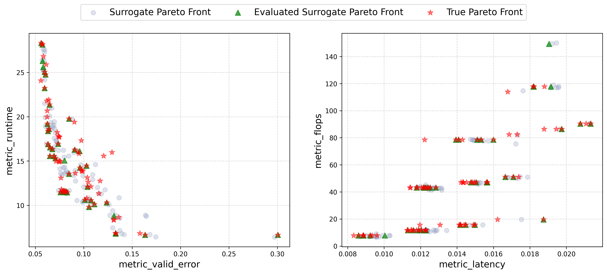
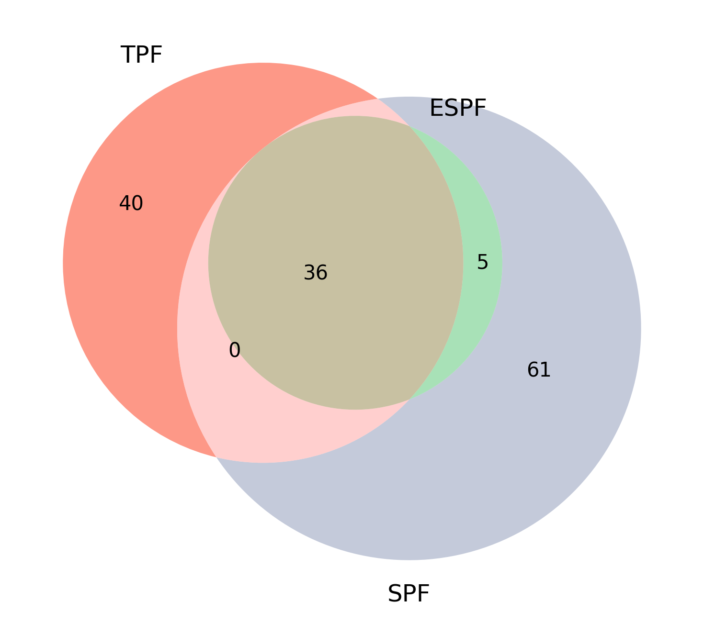
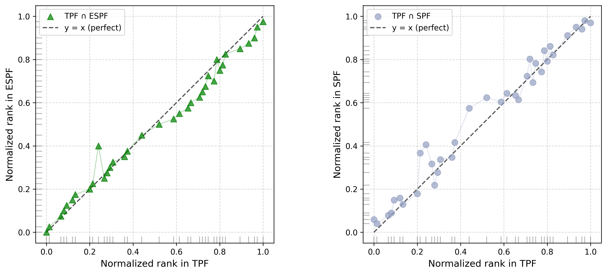

# Surrogate-Assisted Multi-Objective Optimization

**Find the best trade-offs when you can't optimize everything at once.**

In real product decisions — model accuracy, inference latency, training cost, compute budget — improving one metric often hurts another. This project builds an end-to-end **multi-objective optimization (MOO)** pipeline that maps out those trade-offs efficiently: use cheap surrogate models to screen thousands of candidates, then verify only the most promising ones with full evaluation.

**Domain:** Neural Architecture Search (NAS-Bench-201, CIFAR-10)  
**Stack:** Python · scikit-learn · XGBoost/LightGBM · pymoo · pandas

---

## The Problem

Full evaluation of every design option is expensive. In NAS, training a single architecture to convergence can take hours on GPU. With **15,625** candidate architectures and **4 competing objectives**, exhaustive search is not feasible.

| Objective | What it captures | Business angle |
|-----------|------------------|----------------|
| Validation error | Model quality | Does it actually work? |
| Training runtime | Development cost | How long until we know? |
| Inference latency | User experience | Is it fast enough to deploy? |
| FLOPs | Hardware cost | Can we afford to run it? |

The goal is not a single "best" architecture — it is the **Pareto front**: the set of solutions where no objective can improve without worsening another. That front is the decision menu for stakeholders with different priorities.

---

## The Approach

```
  15,625 candidates
        │
        ▼
  ┌─────────────────┐
  │ Surrogate models │  ← fast prediction (seconds, not GPU-hours)
  └────────┬────────┘
           ▼
  ┌─────────────────┐
  │  Pareto filter   │  ← non-dominated sorting in predicted space (SPF)
  └────────┬────────┘
           ▼
  ┌─────────────────┐
  │ Re-evaluate top  │  ← confirm with true metrics (ESPF)
  │   candidates     │
  └────────┬────────┘
           ▼
     Decision-ready trade-off set
```

1. **Train tuned surrogates** — one model per objective, selected via cross-validation benchmark.
2. **Extract Surrogate Pareto Front (SPF)** — non-dominated solutions in predicted objective space.
3. **Re-evaluate & filter (ESPF)** — run true metrics on SPF candidates, then re-apply Pareto filtering to remove surrogate false positives.
4. **Compare against True Pareto Front (TPF)** — ground truth on the held-out test set.

This is a practical **surrogate-assisted MOO** workflow: cheap search at scale, expensive evaluation only where it matters.

---

## Key Results

| Metric | Value | Takeaway |
|--------|-------|----------|
| ESPS precision | **87.8%** | Most verified candidates are genuinely optimal |
| Recall of true Pareto set | **47.4%** | Captures nearly half of all true trade-off solutions |
| False positives (SPF → ESPF) | **64.7% → 12.2%** | Re-evaluation cuts bad picks by ~5× |

**Bottom line:** Surrogate-guided Pareto selection is fast, but not trustworthy on its own. Adding a verification step turns it into a reliable decision-support tool — relevant anywhere expensive simulations or experiments sit behind optimization (supply chain, scheduling, hyperparameter tuning, engineering design).

---

## Visual Results

### Pareto trade-off fronts

Two objective pairs from the 4D Pareto front. Green triangles (ESPF) sit close to red stars (true optimum); grey circles (SPF) show where surrogate-only selection over-predicts.



*Left: accuracy vs. training cost · Right: latency vs. compute (FLOPs)*

---

### Overlap with the true optimal set

Venn diagram of architecture IDs across TPF, ESPF, and SPF. **36 architectures** appear in all three sets — the core trade-off solutions every method agrees on.

<p align="center">
  
</p>
---

### Rank preservation after verification

Do surrogate-selected solutions keep their relative priority after true re-evaluation? ESPF (left, green) tracks the true ranking closely; SPF alone (right, grey) drifts more — another reason to verify before committing resources.



---

## What This Demonstrates (for optimization roles)

- **Multi-objective framing** — Pareto dominance, non-dominated sorting, trade-off visualization across 4 objectives
- **Surrogate-assisted optimization** — replace expensive evaluators with ML models; quantify prediction error impact on selection quality
- **Decision pipeline design** — propose → filter → verify, with measurable precision/recall on optimal sets
- **End-to-end reproducibility** — data extraction → model tuning → MOO → analysis, all scripted

---

## Project Structure

```
.
├── data/                          # NAS-Bench-201 CIFAR-10 (15,625 architectures)
├── outputs/
│   ├── surrogate/                 # Tuned model predictions & CV benchmarks
│   ├── pareto/                    # SPF, ESPF, TPF exports
│   └── figures/                   # Result plots (included for README)
├── step1_performance-pairs_extraction.py
├── step2_train_tune_bmr.py        # Train & tune surrogate models
├── step2_visualization.py         # Surrogate quality plots
├── step2_surrogate_pipeline.py    # Surrogate inference for MOO
├── step3_moo_paretofronts.py      # Compute Pareto fronts
├── step3_analysis.py              # Overlap, Pareto plots, rank analysis
├── paths.py
└── requirements.txt
```

---

## Quick Start

```bash
python -m venv .venv
source .venv/bin/activate   # Windows: .venv\Scripts\activate
pip install -r requirements.txt
```

Run the pipeline in order:

```bash
python step1_performance-pairs_extraction.py   # skip if data/ already present
python step2_train_tune_bmr.py
python step3_moo_paretofronts.py
python step3_analysis.py                       # regenerates figures/
```

Optional: `python step2_visualization.py` for surrogate prediction diagnostics.

> Step 3 imports tuned configs from `step2_surrogate_pipeline.py` — run Step 2 first.

**Requirements:** Python 3.10+

---

## Data

NAS-Bench-201 provides fully trained architecture metrics on CIFAR-10 (epoch 200). Step 1 can download via [SyneTune](https://github.com/syne-tune/syne-tune); a pre-extracted CSV is included in `data/` for convenience.

---

## License

Academic research code. Add a license file before public release if needed.
